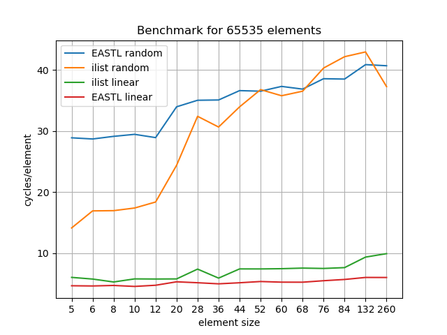

# Index based linked list

Investigation into whether a linked list where the next/prev 'pointers' are indices into an array can be faster than EASTL's intrusive linked list implementation in niche scenarios.

The idea is that if the next/prev pointers are indices, we can save memory overhead: it saves 8 bytes/node for 32 bit indices, 12 bytes for 16 bit indices and if you're really crazy 14 bytes for 8 bit indices. So for data sets sizes which are close to the boundary between the different caches or main memory, this may see a performance benefit by allowing the data to be fully in cache.

The main downside is that the LinkedList now needs to own the backing array, which means it's also an allocator of nodes.

The performance is slightly worse for linear access patterns and much better for random access patterns (but I'm suspicious of this, it needs further investigation whether the processor is just somehow guessing better due to the way I'm shuffling the memory, or there's a bug in the system).

Here I'm using a linked list with next/prev pointers as uint16_t. This means 12 bytes/node savings, which is considerable for linked lists where its elements are < 256 bytes: 4+% savings in terms of memory.